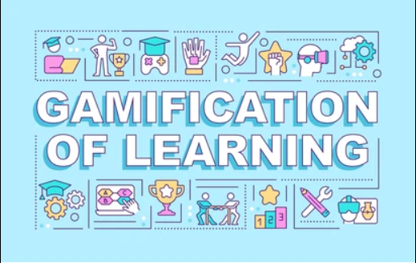

```markdown
# Gamified Learning Platform


## Vision

The Gamified Learning Platform aims to revolutionize the educational experience by integrating blockchain technology to provide a rewarding system that incentivizes users. By using smart contracts to issue and manage custom tokens and NFTs, this platform creates a more engaging, transparent, and rewarding learning journey. Users are motivated to complete learning milestones, while gaining valuable digital assets that reflect their achievements.

## Project Features

- **LearnToken (ERC-20):** A custom fungible token named "IQ Points" (`IQP`) that serves as the primary currency within the platform. Users earn these tokens by completing learning activities and milestones.
- **AchievementNFT (ERC-721):** Unique NFTs called "EinsteinNFT" (`ENFT`) that represent significant achievements. Each NFT is a distinct digital asset that signifies a user's accomplishment.
- **MilestoneVerifier:** A smart contract that verifies user milestones and awards LearnTokens and AchievementNFTs accordingly.

## Future Scope

1. **Enhanced Reward System:** Integrate additional features such as staking mechanisms where users can earn more tokens based on their activity or participation levels.
2. **Marketplace Integration:** Develop a marketplace where users can trade or showcase their AchievementNFTs and LearnTokens.
3. **Cross-Platform Compatibility:** Extend the platform to support other educational or gamified applications, allowing for a broader ecosystem.
4. **Advanced Analytics:** Implement analytics tools to track user progress and reward distribution, enhancing the personalization of the learning experience.
5. **Governance:** Introduce decentralized governance mechanisms allowing token holders to participate in decision-making processes related to platform updates and policies.

## Project Structure
```bash
/gamified-learning-platform
├── contracts
│   ├── LearnToken.sol
│   ├── AchievementNFT.sol
│   ├── MilestoneVerifier.sol
│   └── interfaces
│       ├── ILearnToken.sol
│       └── IAchievementNFT.sol
├── migrations
│   └── 1_deploy_contracts.js
├── test
│   ├── LearnToken.test.js
│   ├── AchievementNFT.test.js
│   ├── MilestoneVerifier.test.js
│   └── helpers
│       └── testHelpers.js
├── scripts
│   ├── deploy.js
│   └── mint_tokens.js
├── frontend
│   ├── public
│   ├── src
│   │   ├── components
│   │   ├── hooks
│   │   ├── pages
│   │   └── styles
│   ├── package.json
│   └── webpack.config.js
├── docs
│   ├── architecture.md
│   ├── API.md
│   └── tutorials
├── README.md
├── LICENSE
├── package.json
├── truffle-config.js
└── .gitignore
```


## Development Details

### Prerequisites

- **Node.js and NPM**: Ensure Node.js and NPM are installed to manage dependencies and run scripts.
- **Truffle or Hardhat**: Ethereum development frameworks used for compiling, testing, and deploying smart contracts.
- **Metamask**: A browser extension wallet for interacting with the Ethereum network.

### Installation and Setup

1. **Install Dependencies:**
   ```bash
   npm install
   ```

2. **Compile Contracts:**
   ```bash
   truffle compile
   ```

3. **Deploy Contracts:**
   ```bash
   truffle migrate --network <network_name>
   ```
   Replace `<network_name>` with the desired network (e.g., `development`, `rinkeby`, `mainnet`).

4. **Deployment Addresses:**
   After deployment, note the addresses of `LearnToken`, `AchievementNFT`, and `MilestoneVerifier` contracts for interacting with them.

### Interacting with Contracts

You can interact with the contracts through Truffle Console, Remix IDE, or integrate them into a front-end application using web3.js or ethers.js. Example interactions include:

- **Mint LearnTokens:** Call the `mint` function in the `LearnToken` contract.
- **Award AchievementNFTs:** Call the `mint` function in the `AchievementNFT` contract for significant milestones.
- **Verify Milestones:** Use the `MilestoneVerifier` contract to automate the process of issuing tokens and NFTs.

### Front-End Integration

Develop a web application to interact with these contracts, enabling users to connect their Ethereum wallets, complete learning activities, and receive rewards. Use libraries like web3.js or ethers.js to facilitate interactions with the blockchain.

## Contributing

Contributions are welcome! Please submit a pull request or open an issue to discuss improvements, report bugs, or suggest new features.

---

## Developer Details

- **Name:** Abhiraj Kuntal
- **Contact:** abhirajkuntal0807@gmail.com

## Deployment 
- **Chain Name:** Educhain Open Campus
- **Contract Id:** 0x6f458129298334ab3e8c320ff0d16c03b56a6fe2


```
